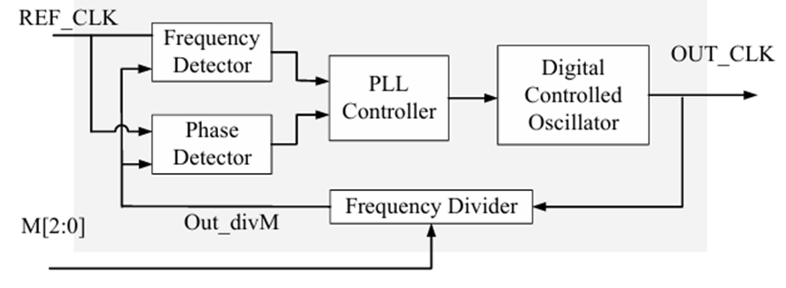
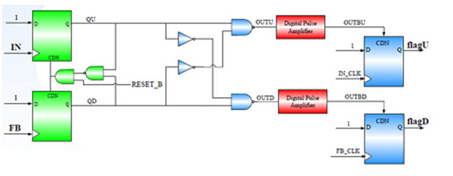
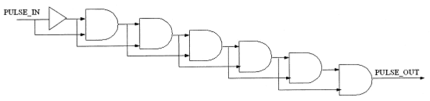
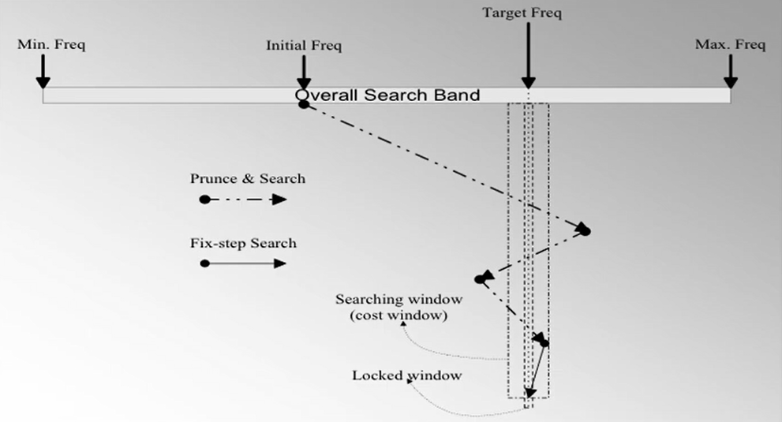
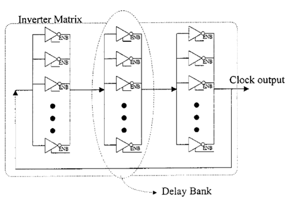

# All-Digital Phase-Locked Loop (ADPLL)

This project implements an **All-Digital Phase-Locked Loop (ADPLL)** using Verilog HDL and HSPICE simulation methodology.

The ADPLL architecture consists of:

- Phase Frequency Detector (PFD)
- Digital Pulse Amplifier (DPA)
- PLL Controller
- Digitally Controlled Oscillator (DCO)
- Frequency Divider

The functionality of the ADPLL was verified through:

- Behavioral Simulation
- AMS Mixed-Mode Simulation

<br>


# Table of Contents

- [Specifications](#specifications)

- [Repository Layout](#repository-layout)

- [Architecture](#architecture)
  - [ADPLL Overview](#adpll-overview)
  - [Phase Frequency Detector (PFD)](#phase-frequency-detector-pfd)
  - [Digital Pulse Amplifier (DPA)](#digital-pulse-amplifier-dpa)
  - [PLL Controller](#pll-controller)
  - [Digitally Controlled Oscillator (DCO)](#digitally-controlled-oscillator-dco)
  - [Frequency Divider](#frequency-divider)

- [Simulation & Verification](#simulation--verification)
  - [Verification Flow](#verification-flow)
  - [RTL Simulation](#rtl-simulation)

- [Simulation Result](#simulation-result)
  - [U18 Process Result](#u18-process-result)
  - [ADFP 16nm Process Result](#adfp-16nm-process-result)

- [Mixed-Mode Simulation](#mixed-mode-simulation)

- [Tools & Environment](#tools--environment)

<br>


# Specifications

| Item | Description |
|---|---|
| Target Process | UMC 180nm / TSMC ADFP 16nm |
| Reference Clock | 37.1 MHz ~ 14.94 GHz |
| Output Clock | 259.4 MHz ~ 14.94 GHz |
| Divider Ratio | M = 1 ~ 7 |
| DCO Control Code | 7-bit digital control code |
| Lock Time | 8 ~ 62 cycles |
| Verification | Behavioral + AMS Simulation |

<br>


# Repository Layout

```text
rtl/
  ADPLL.v        Top-level ADPLL integration
  CONTROLLER.v   Bang-bang PLL controller and lock control
  DCO.v          Behavioral DCO frequency model
  FREQ_DIV.v     Programmable feedback divider
  PFD.v          Phase frequency detector model
  RESET_INV.v    Reset polarity inverter

tb/
  TOP.v           Top-level behavioral simulation wrapper
  test_MONITOR.v  Divider-ratio monitor testbench
  tb_freq_sweep.v Frequency sweep testbench

spice/
  DCO.sp          SPICE-level DCO implementation
  PFD.sp          SPICE-level PFD implementation

scripts/
  Period_Jitter.py   Period jitter post-processing script
  C-to-C_Jitter.py   Cycle-to-cycle jitter post-processing script

img/
  Architecture_ADPLL.png
  Architecture_Controller.png
  Architecture_DCO.png
  Architecture_DPA.png
  Architecture_PFD.png
```

<br>


# Architecture

## ADPLL Overview

<p align="center">
  
</p>

The top-level ADPLL is implemented in `rtl/ADPLL.v`.

The signal flow is:

```text
REF_CLK
  -> PFD
  -> CONTROLLER
  -> DCO
  -> FREQ_DIV
  -> PFD feedback input
```

The top-level ports are:

| Port | Direction | Description |
|---|---|---|
| `REF_CLK` | Input | Reference clock |
| `M2`, `M1`, `M0` | Input | 3-bit divider ratio control, encoded as `{M2, M1, M0}` |
| `RESET` | Input | Active-high reset |
| `OUT_CLK` | Output | DCO output clock |
| `LOCK` | Output | Controller frequency-lock indicator |

<br>


## Phase Frequency Detector (PFD)

<p align="center">
  
</p>

The PFD is implemented using a cell-based tri-state Bang-Bang architecture.

It compares:

- Reference clock
- Feedback clock from the frequency divider

and generates active-low phase decision signals:

- `flagU`
- `flagD`

These signals are used by the PLL controller to increase or decrease the DCO control code.

<br>


## Digital Pulse Amplifier (DPA)

<p align="center">
  
</p>

The DPA is implemented using a multi-stage digital delay chain in the architecture.

It amplifies and aligns pulse signals to improve phase tracking stability. In the behavioral RTL flow, this pulse-shaping behavior is represented inside the PFD model through delay and dead-zone modeling.

<br>


## PLL Controller

<p align="center">
  
</p>

The controller adjusts the DCO control code according to phase error information from the PFD.

Features:

- Bang-bang phase tracking
- Step-size based frequency convergence
- 7-bit DCO code control
- Lock-state control through `FREQ_LOCK`
- Anchor-code adjustment after lock

The behavioral controller output is:

```text
DCO_CODE[6:0]
```

<br>


## Digitally Controlled Oscillator (DCO)

<p align="center">
  
</p>

The DCO generates the output clock according to the digital control code.

In the behavioral RTL model, `DCO_CODE[6:0]` selects a period value from a lookup table. In the transistor-level flow, the oscillation frequency is adjusted using tri-state buffer based delay stages with binary-weighted control.

Features:

- Digitally controlled frequency tuning
- 7-bit period lookup in behavioral simulation
- Fully digital architecture
- Binary-weighted delay control in the circuit implementation
- Clock generation for ADPLL feedback loop

<br>


## Frequency Divider

The divider generates the feedback clock used for PLL synchronization.

A programmable counter-based divider is used for frequency division ratio:

```text
M = {M2, M1, M0}
M = 1 ~ 7
```

When `M = 1`, the divider passes the DCO clock directly to the feedback path. For larger divider values, the counter produces the divided feedback pulse used by the PFD.

<br>


# Simulation & Verification

## Verification Flow

```text
RTL Design
    |
    v
Behavioral Simulation
    |
    v
AMS Mixed-Mode Simulation
    |
    v
Waveform Verification
    |
    v
Jitter Measurement
```

<br>


## RTL Simulation

The behavioral RTL can be compiled with the provided testbench:

```sh
iverilog -Wall -I rtl -I tb -o sim.vvp tb/TOP.v
vvp sim.vvp
```

The original waveform dump calls in the testbench are wrapped with:

```verilog
`ifdef FSDB
```

so the same testbench can run in Icarus Verilog without FSDB system-task errors, while still supporting FSDB dump in simulator flows that define `FSDB`.

<br>


# Simulation Result

## U18 Process Result

| Item | Result |
|---|---|
| Output Frequency | 259.4 MHz ~ 1333.3 MHz |
| Lock Time | 8 ~ 21 cycles |
| Period Jitter | 0.562 ns |
| Cycle-to-Cycle Jitter | 0.582 ns |
| Avg Power | 3.628 mW |

<br>


## ADFP 16nm Process Result

| Item | Result |
|---|---|
| Output Frequency | 4.514 GHz ~ 14.94 GHz |
| Lock Time | 21 ~ 62 cycles |
| Period Jitter | 3.120 ps |
| Cycle-to-Cycle Jitter | 3.480 ps |
| Avg Power | 1.119 mW |

<br>


# Mixed-Mode Simulation

The Verilog behavioral models:

- `DCO.v`
- `PFD.v`

were replaced with SPICE-level implementations:

- `DCO.sp`
- `PFD.sp`

to perform AMS mixed-mode simulation.

<br>


# Tools & Environment

- Verilog HDL
- Icarus Verilog
- HSPICE
- Cadence ADE-L
- Synopsys VCS
- Synopsys XA
- AMS Mixed-Mode Simulation
